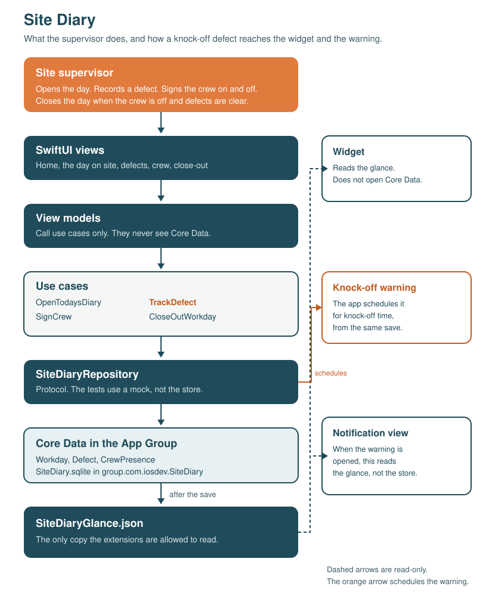

# Site Diary

Required document. Problem, design, architecture, and reflection.

## 1. Problem statement

A construction site supervisor has to keep the daily site diary: what happened on that day, who was on site, and which defects still have to be cleared before knock-off. The record is only useful if it is made while the day is happening. A note written on Friday, or reconstructed after a dispute has started, is a weaker record than one made at the time.

The person who feels this is the site supervisor, not a generic user and not the head office. They are on the job, often moving between levels, and they are the one who can see whether a defect is still open and whether a worker is still signed on. If they do not write it down then, nobody else was there to write it later.

When the diary is a paper notebook, several ordinary failures follow. The book stays with one person, so the day disappears when they leave or the notebook is lost. Entries get written up after the fact, once the weather, the names, and the location of a defect have already gone soft. A defect that must be cleared before knock-off is easy to walk past, because the list is in a book that is not in their hand. Someone still signed on is easy to miss for the same reason. The cost is a day that cannot be closed honestly, a defect the next crew has to find without a location, and a record that will not hold up if the job is questioned later.

This is a documented problem, not a guessed one. VIABUILD, written by a licensed NSW builder, describes the site diary as the contemporaneous record behind extension-of-time claims, disputed variations, and later defect allegations, and it names a diary locked in one person’s notebook as a way that record loses its value. FocusIMS, writing about Australian site practice, says SafeWork NSW inspectors expect accurate, current records, and that paper diaries get lost, damaged, or left behind. Safe Work Australia’s Model Code of Practice for construction work treats inspection and the review of risk controls as part of managing the work. The supervisor is the person on site who can do that inspection while the day is still open.

### Sources

- Caldon, B. (2026). *Site diaries and daily site records*. VIABUILD. https://www.viabuild.au/knowledge/site-diaries-and-daily-records
- Han, A. (2025). *How to keep a better construction site diary*. FocusIMS. https://focusims.com.au/construction-site-diary/
- Safe Work Australia. (2022). *Model Code of Practice: Construction work*. https://www.safeworkaustralia.gov.au/sites/default/files/2022-10/Model%20Code%20of%20Practice%20-%20Construction%20Work%20-%2021102022%20.pdf

## 2. Design justification

### Why an iPhone

The diary has to be with the supervisor while they walk, not at a desk at the end of the day. A website assumes a browser, a reliable connection, and a moment to sit down. A desktop application assumes they are back at the office, which is exactly when the record has already become a reconstruction. An iPhone is already in a pocket on site. It works with no signal, it can put the open day on the home screen, and it can raise a warning at knock-off without the supervisor going looking for the book. Those are the capabilities this job actually uses: offline storage, a home screen widget, and a local notification with its own content.

### Why these extensions

The widget is for the gap between walks. The supervisor wants the open working day without unlocking the phone: which site, which date, whether that day is still open, how many knock-off defects remain, and who is still signed on. Small, medium, and large sizes show that same glance. If the widget were removed, they would have to open the app to answer a question they ask many times a day.

The notification content extension is for knock-off itself. When that time passes, the banner says whether nothing is left open and the crew has signed off, a knock-off defect is still open, someone is still signed on, or both. Holding the notification replaces the default body with the site and those lists. The point is not a generic reminder. It is the list they would otherwise have to open the diary to see, at the moment people are leaving.

### Why Core Data

The diary is private to one supervisor and one phone, and it has to save while they are still standing at the defect. Sites often have no useful reception under a slab or in a stair. Core Data keeps Workday, Defect, and CrewPresence on the device, related to each other, and available with the phone in flight mode. CloudKit would be the right store if several supervisors shared one diary, or if the office had to see the entry as it was written. That is a real need, and a diary that never leaves one phone is fragile, but syncing a half-finished day is a different product. This one had to be fast and local first.

## 3. Architecture diagram

One page. The supervisor’s action enters at the top. The orange use case, TrackDefect, is the primary path: record or clear a defect. The repository is the only writer of the database and of the glance. The widget and the notification view only read the glance.

## 4. Reflective report

I chose a site supervisor’s daily diary because the record only works if it is written on the day, on the site, by the person who can see the work. VIABUILD describes that diary as the contemporaneous record that later decides an extension of time, a variation, or a defect dispute, and it is blunt about a notebook that lives with one person: when they leave, or the book is lost, the evidence goes with them. FocusIMS makes the compliance point. SafeWork NSW inspectors expect an accurate, current diary, and a paper book is easy to damage or leave behind. Safe Work Australia’s Model Code of Practice for construction work treats inspection, and the review of risk controls, as part of managing the work. The supervisor is the person on the site who can do that while the day is still happening.

I started from replacing the notebook. The diary is the record of the site, the date, knock-off, defects, and who signed on. The failure I kept meeting is the last part of the day: a defect that must still be cleared, or a worker still signed on, while the supervisor is not standing in front of the book. The home screen and the knock-off warning became the product because that is when the notebook fails.

The widget is the glance between walks. It shows the working day the diary last published: the site, the date, whether that day is still open, the knock-off defects still open, and who is still signed on. A supervisor would notice if it were removed. I first tied the widget to today’s calendar date. That is wrong when the day still being worked is not today, so the repository publishes the open working day and the widget follows that.

The notification content extension is the moment knock-off passes. The banner says which situation is true: nothing is left open and the crew has signed off, a knock-off defect is still open, someone is still signed on, or both. Holding it shows the names and locations from the same glance as the widget. The supervisor would notice its absence on a day something is still outstanding, because that warning is the prompt to go back before people leave.

I chose Core Data rather than CloudKit because this diary belongs to one supervisor and one phone, and a site often has no useful signal under a deck or in a basement. The save has to finish while they are still standing at the defect. CloudKit would matter if several supervisors shared one diary, or if the office had to see the entry as it was written. A record that never leaves one phone is a real limit. A fast private store matched the constraint I had.

The schema decision that mattered most was three related records, and one diary for a calendar date. A workday owns its defects and its crew. A defect is either still open or cleared, and the ones that must be gone before knock-off are a query in the repository, not a flag the screen invents. Signing a worker off and back on updates the same crew presence, so the day does not fill with duplicate names. Close-out refuses to finish while a knock-off defect is open or anyone is still signed on. The glance is built from that same query, so the screen, the widget, and the warning agree about what “still open” means.

The requirement that fought the interface was the extension. I wanted the widget and the warning to show the live diary. A widget and a notification content extension are a poor place to open a Core Data stack: they are short-lived, and a second stack racing the app is how the glance gets wiped. What they read is a small JSON file in the App Group, written only after the repository has saved, and only by that repository. The widget is told to reload, and the warning is scheduled, in that same moment. The cost is a copy. If the write is skipped or overwritten, the home screen lies. That happened when a stand-in repository, there so SwiftUI has a default value, published an empty glance over the real one. The fix was to wait until the store has loaded, and not let that stand-in publish. The extensions stay simple because they are not a second database.

I used an AI coding assistant for most of the implementation: the repository, the use cases, the screens, both extensions, and the later edits. It was useful when the task was a stated rule, such as refusing to close the day while a knock-off defect is still open, because a test against a mock repository could check that rule without the store. It was weak when the result had to be judged on a phone. The large widget drew correctly on its own and did nothing on a home screen with no free block for it. The first warning fired half an hour before knock-off, and only if a defect was open. After using it, I changed the warning so it fires when knock-off passes and says whether a defect, a signed-on worker, both, or neither is still outstanding. I kept the use-case tests and judged the output by running them and by walking the diary.
